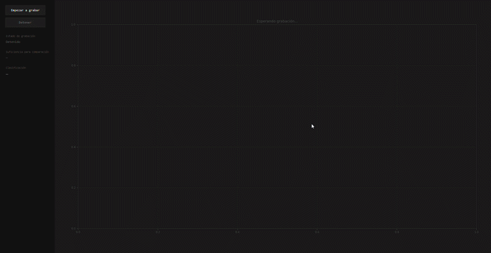
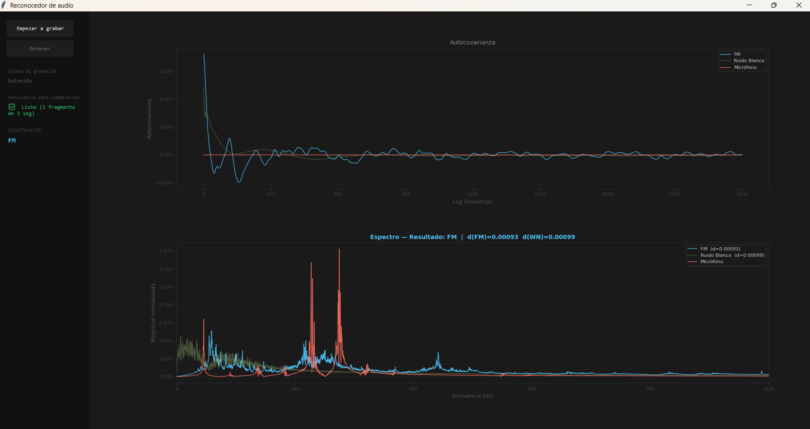

# FM / White Noise Classifier

A signal classification tool that listens through your microphone and determines whether the audio resembles an **FM radio signal** or **white noise** — using autocorrelation, FFT, and vector norm comparison.

> Built with Python · NumPy · librosa · sounddevice · Tkinter · Matplotlib

---

## How it works

The algorithm captures audio in real time, processes it in 2-second windows, and compares the result against pre-computed reference vectors using three DSP stages:

```
Microphone input
      │
      ▼
 Autocorrelation (acovf)
      │
      ▼
 Fast Fourier Transform (FFT)
      │
      ▼
 Magnitude norm vector
      │
      ▼
 L1 distance comparison → FM or White Noise
```

The microphone signal is normalized and compared against the average vectors computed from 100 reference `.wav` files (50 FM · 50 WN). The class with the smaller L1 distance wins.

---

## Screenshots

### 🟢 Recording screen
*Live spectrum while audio is captured*



---

### 📊 Classification result
*Comparative autocovariance + spectrum view*



---


## Project structure

```
FM-WN-Noise-Classifier-Algorithm/
│
├── main.py                        # Entry point
│
└── src/
    ├── data/
    │   ├── FM/                    # 50 FM reference .wav files (IS01–IS50)
    │   └── WN/                    # 50 white noise .wav files  (IS51–IS100)
    │
    ├── dataset/                   # Pre-computed reference vectors (generated by training)
    │   ├── fmVector.txt           # Average norm vector — FM
    │   ├── wnVector.txt           # Average norm vector — White Noise
    │   ├── fmAcov.txt             # Average autocovariance — FM
    │   ├── wnAcov.txt             # Average autocovariance — White Noise
    │   ├── micProcessed.txt       # Last mic norm vector
    │   └── micAcov.txt            # Last mic autocovariance
    │
    ├── interface/
    │   └── interface.py           # Tkinter GUI + Matplotlib plots
    │
    ├── loaders/
    │   └── loaderDataSet.py       # Training pipeline (loads .wav → saves vectors)
    │
    ├── models/
    │   └── classifier.py          # Classification logic (L1 distance comparison)
    │
    ├── processing/
    │   └── process.py             # DSP core: autocorrelation, FFT, norm
    │
    └── utils/
        └── audioTransformer.py    # Thread-safe mic buffer + windowed processing
```

---

## Requirements

| Package | Purpose |
|---|---|
| `numpy` | Vector math and FFT |
| `librosa` | Audio loading and resampling |
| `sounddevice` | Real-time microphone input |
| `statsmodels` | Autocovariance computation (`acovf`) |
| `matplotlib` | Signal plots embedded in GUI |
| `tkinter` | GUI framework (included with Python) |

Install all dependencies:

```bash
pip install numpy librosa sounddevice statsmodels matplotlib
```

> **Note:** `tkinter` ships with standard Python on Windows and macOS. On Linux you may need `sudo apt install python3-tk`.

---

## Getting started

### 1 — Clone the repository

```bash
git clone https://github.com/your-username/FM-WN-Noise-Classifier-Algorithm.git
cd FM-WN-Noise-Classifier-Algorithm
```

### 2 — (Optional) Re-train the reference vectors

The `src/dataset/` folder already contains pre-computed vectors, so this step is only needed if you want to regenerate them from the raw `.wav` files:

```bash
python -c "from src.loaders.loaderDataSet import train; train()"
```

This reads all 100 `.wav` files, computes the average autocorrelation + FFT norm for each class, and saves the results to `src/dataset/`.

### 3 — Run the application

```bash
python main.py
```

---

## Usage

1. Click **Empezar a grabar** — the app opens your microphone and starts streaming.
2. Hold a signal source (FM radio, a phone playing static, etc.) near the mic for at least **2 seconds**.
3. The live spectrum updates in real time as fragments are processed.
4. Click **Detener** — the app classifies the audio and shows:
   - The **classification label** (FM or White Noise)
   - L1 distances to each reference class
   - A two-panel comparative plot: autocovariance (top) and spectrum (bottom)

---

## Signal processing details

| Stage | Function | Details |
|---|---|---|
| Autocovariance | `statsmodels.tsa.stattools.acovf` | FFT-accelerated, zero-meaned |
| Spectrum | `numpy.fft.fft` applied to autocovariance | Converts time-domain pattern to frequency |
| Feature vector | `numpy.abs(fft)` | Magnitude only (phase discarded) |
| Comparison | Mean absolute error (L1) | Applied on normalized vectors |

Audio is captured at **44 100 Hz**, processed in **2-second windows** (88 200 samples each). Multiple windows are averaged to reduce noise before classification.

---

## License

This project is released for academic and educational use. See `LICENSE` if present, or contact the author for terms.
